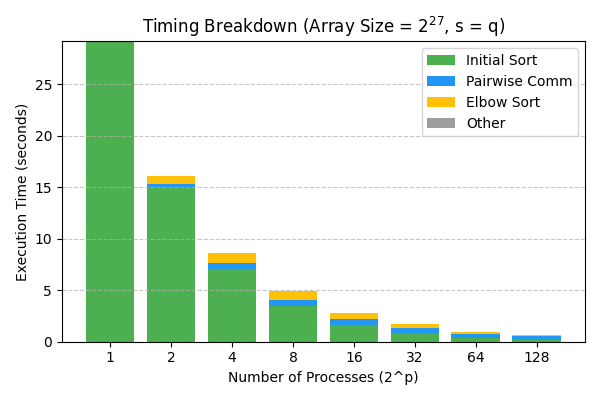

# Bitonic Sort MPI

This project implements a **distributed hybrid sort using Bitonic interchanges**, leveraging 
**MPI (Message Passing Interface)** for inter-process communication. The project includes automated 
benchmarking and performance visualization, executed on the **Aristotelis HPC Cluster** of **ECE AUTH**.

---

## Table of Contents

- [Problem Overview](#problem-overview)
  - [Algorithm Summary](#algorithm-summary)
- [Requirements](#requirements)
- [Project Structure](#project-structure)
- [Build Instructions](#build-instructions)
- [Run Tests](#run-tests)
- [Execution Time Breakdown](#execution-time-breakdown)
- [Run Benchmarks (on Aristotelis HPC)](#run-benchmarks-on-aristotelis-hpc)
  - [Step 1: Connect to Aristotelis HPC](#step-1-connect-to-aristotelis-hpc)
  - [Step 2: Upload Project](#step-2-upload-project)
  - [Step 3: Submit Benchmark Job](#step-3-submit-benchmark-job)
- [Acknowledgments](#acknowledgments)

---

## Problem Overview

The goal is to **sort `N = 2^(p + q)` integers in ascending order**, distributed among 
**`2^p` MPI processes**. Each process is initialized with **`2^q` random integers**. 
The Bitonic Sort algorithm guides the data exchange between processes using non-blocking 
MPI communication.

### Algorithm Summary:
- Each process **locally sorts** its data (ascending or descending based on rank parity).
- Processes **communicate in pairs** according to **Bitonic Sort stages** using non-blocking sends 
and receives.
- A **pairwise min-max exchange** is applied to move smaller elements towards lower ranks and larger 
elements towards higher ranks.
- After multiple log-scaled iterations, each process applies a **final elbow sort** to achieve a
globally sorted order.
- The result is **validated** using serial sorting for correctness.

---

## Requirements
- **MPI implementation** (e.g., OpenMPI, MPICH)
- **Python 3** (with `pandas`, `numpy` and `matplotlib`)
- **Slurm workload manager** (for submitting jobs on Aristotelis)

## Project Structure
- **`.github`**: CI/CD pipelines (GitHub Actions)
- **`.vscode`**: VSCode development configuration
- **`benchmarks`**: Benchmarking scripts and logs
- **`docs`**: Documentation and generated figures
- **`include`**: Header files
- **`scr`**: Source code
- **`tests`**: Unit tests and validation scripts

## Build Instructions

Clone this repository
```bash
git clone https://github.com/georrous6/bitonic-sort-mpi.git
cd bitonic-sort-mpi
```

Build the project with make:
```bash
make
```

## Run Tests
To run the tests type
```bash
cd tests
chmod +x run_tests.sh
./run_tests.sh
```

## Execution Time Breakdown

| **p** | **q** | **Initial Sort (%)** | **Pairwise Sort (%)** | **Elbow Sort (%)** | **Other (%)** |
|-------|-------|---------------------|----------------------|-------------------|--------------|
| 0     | 27    | **100.00**          | 0.00                 | 0.00              | 0.00         |
| 1     | 26    | **92.79**           | 2.54                 | 4.66              | 0.01         |
| 2     | 25    | **81.27**           | 6.79                 | 11.93             | 0.01         |
| 3     | 24    | **69.53**           | 12.42                | 18.04             | 0.01         |
| 4     | 23    | **58.09**           | 21.84                | 20.06             | 0.02         |
| 5     | 22    | **43.02**           | 35.50                | 21.45             | 0.03         |
| 6     | 21    | 29.92               | **50.97**            | 19.08             | 0.03         |
| 7     | 20    | 17.07               | **66.08**            | 16.81             | 0.05         |



## Run Benchmarks (on Aristotelis HPC)
To run the benchmarks you must have access the the Aristotelis HPC Cluster.

### Step 1: Connect to Aristoteis HPC
Connect to Aristotelis HPC Cluster via ssh:
```bash
ssh [username]@aristotle.it.auth.gr
```
Replace `username` with your institutional username.

### Step 2: Upload Project
You can either:

- **Upload locally cloned project:**
```bash
scp -r bitonic-sort-mpi/ [username]@aristotle.it.auth.gr:path/to/destination/
```
Replace `username` with your institutional username and `path/to/destination` to the desired destination.

- **Or clone directly on Aristotelis:**
```bash
git clone https://github.com/georrous6/bitonic-sort-mpi.git
```

### Step 3: Submit Benchmark Job
```bash
cd bitonic-sort-mpi
sbatch --nodes=4 benchmarks/run_benchmarks.sh </path/to/bitonic-sort-mpi>
```
Replace `/path/to/bitonic-sort-mpi` with the installation path of the repository.

Adjust the number of nodes based on the available HPC resources.

You can check the status of the submitted job with
```bash
squeue -u $USER
```

## Acknowledgments

The experiments presented in this work were conducted using the Aristotelis HPC cluster at Aristotle 
University of Thessaloniki (AUTH).