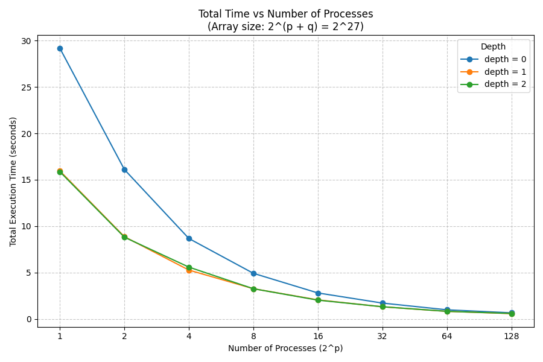

# Bitonic Sort MPI


This project implements a **distributed hybrid sorting algorithm based on Bitonic Sort**, using **MPI** 
for inter-process communication and **OpenMP** for intra-process parallelism. It supports automated benchmarking 
and performance visualization on the **Aristotelis HPC Cluster** at **ECE AUTH**.

---

## Table of Contents

- [Problem Overview](#problem-overview)
  - [Algorithm Summary](#algorithm-summary)
- [Requirements](#requirements)
- [Project Structure](#project-structure)
- [Setup Locally](#setup-locally)
  - [Build the Program](#build-the-program)
  - [Run the Program](#run-the-program)
  - [Run Tests](#run-tests)
- [Run Benchmarks (on Aristotelis HPC)](#run-benchmarks-on-aristotelis-hpc)
- [Benchmark Results](#benchmark-results)
  - [Execution Time Breakdown](#execution-time-breakdown)
  - [OpenMP Parallelization](#openmp-parallelization)
- [Acknowledgments](#acknowledgments)

---

## Problem Overview

The objective is to **sort `N = 2^(p + q)` integers in ascending order**, distributed across 
**`2^p` MPI processes**, with each process holding **`2^q` elements**. The algorithm uses **Bitonic Sort** 
for orchestrating inter-process communication, enhanced with **OpenMP** to accelerate local sorting.

### Algorithm Summary

- Each process performs an **initial local sort** using `qsort()` or parallel OpenMP-based merge sort (if enabled).
- Processes exchange data in **logarithmic Bitonic stages** using **non-blocking MPI** communication.
- At each stage, processes conduct **pairwise min-max exchanges** to form Bitonic sequences.
- A final **elbow sort** ensures full global ordering.
- Correctness is verified by comparing with a serially sorted version of the input.

---

## Requirements

- MPI implementation (e.g., OpenMPI, MPICH)
- Python 3 (with `pandas`, `numpy`, `matplotlib`)
- Slurm workload manager (for HPC usage)

---

## Project Structure

- **`.github`**: CI/CD pipelines (GitHub Actions)
- **`.vscode`**: VSCode development configuration
- **`benchmarks`**: Benchmarking scripts and logs
- **`docs`**: Documentation and generated figures
- **`include`**: Header files
- **`scr`**: Source code
- **`tests`**: Unit tests and validation scripts


---

## Setup Locally

### Clone the Repository

```bash
git clone https://github.com/georrous6/bitonic-sort-mpi.git
cd bitonic-sort-mpi
```

### Build the Program

```bash
make
```

### Run the Program

```bash
cd build
mpirun -np <nprocs> bitonic_sort <p> <q> <s> [options]
```

#### Positional Arguments

- `<nprocs>`: Number of MPI processes
- `<p>`: Such that `nprocs = 2^p`
- `<q>`: Number of elements per process is `2^q`
- `<s>`: Communication buffer size exponent (usually `s ≤ q`)

#### Optional Flags

- `--verbose`: Print detailed logs (e.g., timings, validation)
- `--no-validation`: Skip correctness verification
- `--timing-file <path>`: Export timing stats to CSV
- `--depth <d>`: Use `2^d` OpenMP threads per process for local sorting

> Set the number of OpenMP threads with:
> ```bash
> export OMP_NUM_THREADS=<2^d>
> ```

---

### Run Tests

```bash
cd tests
chmod +x run_tests.sh
./run_tests.sh
```

---

## Run Benchmarks (on Aristotelis HPC)

### 1. Connect to the Cluster

```bash
ssh [username]@aristotle.it.auth.gr
```

### 2. Upload or Clone the Project

**Option A:** Upload your local project

```bash
scp -r bitonic-sort-mpi/ [username]@aristotle.it.auth.gr:/desired/path/
```

**Option B:** Clone from GitHub

```bash
git clone https://github.com/georrous6/bitonic-sort-mpi.git
```

### 3. Submit Benchmark Job

```bash
cd bitonic-sort-mpi
sbatch benchmarks/run_benchmarks.sh /path/to/bitonic-sort-mpi
```

Monitor your job:
```bash
squeue -u $USER
```

---

## Benchmark Results

### Execution Time Breakdown

| **p** | **q** | **Initial Sort (%)** | **Pairwise Comm (%)** | **Elbow Sort (%)** | **Other (%)** |
|------:|------:|----------------------:|------------------------:|--------------------:|---------------:|
| 0     | 27    | 100.00               | 0.00                   | 0.00               | 0.00           |
| 1     | 26    | 92.82                | 2.60                   | 4.57               | 0.01           |
| 2     | 25    | 81.74                | 6.50                   | 11.76              | 0.01           |
| 3     | 24    | 70.68                | 12.17                  | 17.14              | 0.01           |
| 4     | 23    | 59.46                | 19.91                  | 20.62              | 0.01           |
| 5     | 22    | 47.80                | 30.54                  | 21.63              | 0.03           |
| 6     | 21    | 39.51                | 37.67                  | 22.78              | 0.04           |
| 7     | 20    | 30.06                | 49.95                  | 19.92              | 0.07           |


---

### OpenMP Parallelization

| **Processes** | **Speedup (Depth 1)** |                       | **Speedup (Depth 2)** |                       |
|---------------|-----------------------|-----------------------|------------------------|-----------------------|
|               | Initial Sort          | Total Time            | Initial Sort           | Total Time            |
| 1             | 1.83                  | 1.83                  | 1.84                   | 1.84                  |
| 2             | 1.92                  | 1.82                  | 1.93                   | 1.83                  |
| 4             | 1.92                  | 1.65                  | 1.79                   | 1.55                  |
| 8             | 1.88                  | 1.51                  | 1.86                   | 1.51                  |
| 16            | 1.82                  | 1.37                  | 1.84                   | 1.38                  |
| 32            | 1.80                  | 1.31                  | 1.79                   | 1.30                  |
| 64            | 1.77                  | 1.21                  | 1.72                   | 1.20                  |
| 128           | 1.66                  | 1.14                  | 1.59                   | 1.12                  |



---

## Acknowledgments

This project was developed as part of the course **Parallel and Distributed Computer Systems** at the Department of
 Electrical and Computer Engineering, AUTH. Experiments were conducted using the **Aristotelis HPC Cluster**.
